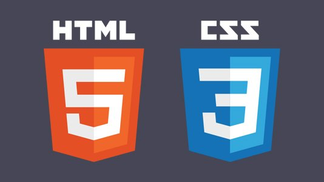

The People, Places & Things Challenge is a full-stack Django application designed to increase the users curiousity, network and foster an attitude of gratitude! 

## About

The People, Places & Things Challenge, asks the user to document their passing thoughts and ideas. The ones that normally get lost in the fray of our daily lives. We all have the, “I’d really like to know more about ‘X’”, or “I should really reach out to ‘Y’” moments. But when we finally do have some free time, we have entirely forgotten about these thoughts. Having a place for these ideas to live and hangout with each other, gives them the potential to grow, evolve and become actions! 

People, Places & Things is not just a notepad or glorified todo list, it is designed to actually foster generation of new ideas and boost your creativity. In science talk.. the goal is to increase the neuroplasticity of your brain by creating new connections via increased neural synapses. It is known that neuroplasticity is 
capable of generation and regeneration throughout our lives, given the right stimuli. This stimuli can be anything. This challenge is designed to stimulate the user's brain and boost their desire to learn, travel, connect and live in gratitude. 

Each day a user decides to do a PPT challenge, they will simply be asked for a bit of information on three different subjects.. you guessed: People, places and things. This process is extremely simple, but it will get the brain firing and the app will automatically save the documented responses. Documenting ones thoughts is the first step to turning them in to reality. 

Let’s get started!

## Screenshots

## Getting Started

The People, Places & Things app is deployed [HERE]()

## Built With

* [Django](https://www.djangoproject.com/)
* [Python](https://www.python.org/)
* [PostgreSQL](https://www.postgresql.org/)
* [HTML](https://developer.mozilla.org/en-US/docs/Web/HTML)
* [CSS](https://developer.mozilla.org/en-US/docs/Learn/Getting_started_with_the_web/CSS_basics)
* [JavaScript](https://www.javascript.com/)
* [MCDatepicker](https://www.npmjs.com/package/mc-datepicker)
* [Google Fonts](https://fonts.google.com/)

## Authors

**John Nelson-Alden**

## Wireframe

## ERD

## User Stories

* AAU, I want to be able to log in via a cross-site request forgery token.
* AAU, I want to be able to log out.
* AAU, I want to be able to create a new People, Places & Things Daily Challenge.
* AAU, when I create a new challenge I want to enter an inspiration for that days challenges and the date.
* AAU, while performing the PPT challenge, I want to be able to select the different types of people, places, and things from their respective drop down menus and enter a person, place or thing for each category.
* AAU, I want the application to conditionally render a message when I have completed a Person, Place or Thing section, or display a message that the section is incomplete.
* AAU, I want to be able to edit a daily PPT challenge I created.
* AAU, I want to be able to delete a daily PPT challenge I created.

## Icebox User Stories

* AAU, I want to be able to search through all of my People, Places & Things daily challenges based on their individual properties.
* AAU, I want a dark mode to reduce eyestrain.

